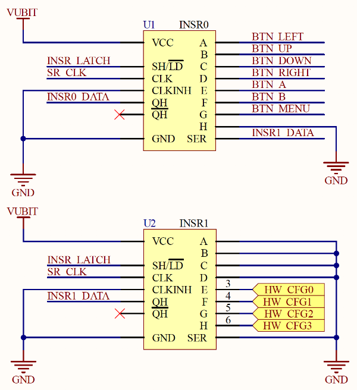

# MakeCode Arcade Shield for micro:bit V2 Specification

**Preliminary, untested design; see below for more details. License: CC-BY 4.0.**

Thank you for your interest in building a [MakeCode Arcade](https://arcade.makecode.com/)
shield for the [new micro:bit V2](https://tech.microbit.org/latest-revision/announcement/).
We hope that you are as excited as we are to bring a wealth of new experiences to users of micro:bit V2 and MakeCode Arcade.

**Arcade Shields will work only with micro:bit V2**; they will not work with the original micro:bit V1.

To enable a diverse ecosystem of Arcade shields for the micro:bit V2 while maintaining a cohesive user experience, 
it is important to standardize software and hardware interfaces.
We have therefore produced a specification along with hardware and firmware reference designs that describe the compatibility
requirements for a MakeCode Arcade display shield for micro:bit V2.
Any shield that is produced must be approved by Microsoft and The Micro:bit Educational Foundation before
it will be publicly listed.

A [PDF schematic](https://raw.githubusercontent.com/microsoft/pxt-arcade-hardware-designs/master/microbit-shield/MicroBitArcadeShieldMVD%2008-1.1.PDF)
of our hardware reference design is available in this folder.
If you view this with Adobe Reader
then clicking on the symbol of each component in the design will show the manufacturer name and part number plus other
details. Other PDF viewing software may not support this feature.

The preliminary information here is provided as a request for comments:
please use the [discussions tab](https://github.com/microsoft/pxt-arcade-hardware-designs/discussions)
or [file an issue](https://github.com/microsoft/pxt-arcade-hardware-designs/issues) in this repo to provide further comments and feedback.

**NOTICE:
This information is provided “as-is”.
You bear the risk of using it.
Aspects of the specification may change without notice.
Microsoft makes no warranties, express or implied, with respect to the information provided here.**

Structure of this document:
- [Desired End-user Experience](#user-experience)
- [Two Ways to Implement an Arcade Shield](#types-shields)
- [Simple Shield Details](#hdw-config)
- [Power](#power)
- [Jacdac](#jacdac)
- [MCU Shield Details](#smart-shield)
- [Arcade Shield Testing](#testing)

## Desired End-user Experience

We want to create an intuitive, simple, reliable and engaging experience for end-users of MakeCode Arcade and micro:bit V2. A user first programs a game at https://arcade.makecode.com/, then clicks the Download
button, selects "micro:bit (V2) with shield" from the dialog (there is only one
entry for all micro:bit shields), and drops the resulting `.hex` file onto the `MICROBIT` drive of their micro:bit V2.
The user can plug their micro:bit V2 into an Arcade shield to play the game.

The micro:bit V2 can be also programmed when plugged into a shield, in which case batteries are not needed in the shield.

## Two Ways to Implement an Arcade Shield

There are two ways to implement an Arcade shield:
- A **simple shield**'s hardware components are all driven directly from the micro:bit V2; the shield itself has no additional microcontroller. The simple shield supports only 128x160 pixel ST7735/ILI9163C SPI screens, which are typically ~1.8" diagonal.
- An **MCU shield** or **smart shield** is fitted with a microcontroller (MCU) that provides a consolidated SPI interface to the micro:bit V2, and may drive a range of different screens including those with an 8-bit parallel connection. The micro:bit uses this SPI interface to update the shield’s display and to support other inputs and outputs such as buttons. MCU shield designers may choose to leverage additional capabilities of the on-shield MCU to attach additional peripherals via GPIOs, I2C or otherwise.

## Simple Shield Details

* [PDF schematics](https://raw.githubusercontent.com/microsoft/pxt-arcade-hardware-designs/master/microbit-shield/MicroBitArcadeShieldMVD%2008-1.1.PDF) of the reference design
* [Bill of Materials](https://github.com/microsoft/pxt-arcade-hardware-designs/blob/master/microbit-shield/BOM%20(complete%20design)%20MicroBitArcadeShieldMVD%2008-1.1.xlsx?raw=true)

As its name suggests, the design of a Simple Shield is straightforward. The micro:bit V2 edge connector 
SPI lines drive the display module directly, although simple low-pass RC filters are likely to be required 
on the SPI data and clock lines to reduce EMI. 
A discrete transistor is used to control the display backlight because a micro:bit GPIO would not be able to 
source the necessary current, ~45mA. 

To reduce the number of micro:bit GPIOs required to interface to
the Arcade control buttons, the reference design for the Simple Shield contains two parallel in, serial 
out shift registers (`INSR0` and `INSR1`). By being economical with micro:bit GPIOs, the three 'ring' GPIOs (P0, P1 and P2) are left available for users to connect to.

There are different variants of 128x160 pixel ST7735/ILI9163C SPI screens, so the MakeCode Arcade software stack needs to determine which is used by a
particular Arcade Shield and its orientation in order to perform the appropriate software configuration.
At power on, the MakeCode Arcade software stack inspects the upper most four bits of
the second input shift register (inputs `HW_CFG0` – `HW_CFG3` of `INSR1`) to determine hardware configuration.
A valid identifier stored in these bits allows the Arcade software stack to perform the appropriate software configuration.

To set a `HW_CFGx` pin to a zero or one, it must be pulled low (to `GND`) or high (to `VUBIT`).
The reference design includes three-way solder jumpers for experimentation.
The tables below summarize the currently-supported hardware configuration identifiers.
If you would like to propose a new configuration please [file an issue in this repo](https://github.com/microsoft/pxt-arcade-hardware-designs/issues).

| `HW_CFG0` | Display rotation
|----------:|-------------------------------
|     0     | Display rotated 180 degrees; screen's flat-flex is on the left.
|     1     | Display not rotated; screen's flat-flex is on the right.

| `HW_CFG3` | `HW_CFG2` | `HW_CFG1` | Hardware configuration
|----------:|----------:|----------:| -----------------------------------------------------
|         0 |         0 |         0 | Reserved, do not use
|         0 |         0 |         1 | ST7735 (`CFG1=0x603` or `CFG1=0x12c2d`; most common)
|         0 |         1 |         0 | ILI9163C with BGR color order (`CFG1=0xe14ff`)
|         0 |         1 |         1 | ST7735 with inverted color values (`CFG1=0x603`, `CFG0 = 0x1??????`)
|         1 |         0 |         0 | Future configuration (micro:bit will hang)
|         1 |         0 |         1 | Future configuration (micro:bit will hang)
|         1 |         1 |         0 | Future configuration (micro:bit will hang)
|         1 |         1 |         1 | Reserved, do not use

Our reference design includes two options for controlling the CS ('chip select') input on a typical SPI display such as one integrating an ST7735 controller IC. These options are selected via a solder-blob jumper, SB4 on the schematic. The simplest approach is to hard-wire CS to logic zero, so that the display is permanently enabled. However, in this case the display may be susceptible to latch-up as a result of an ESD event, and therefore may not pass EMC compliance testing. [Kitronik Ltd](https://kitronik.co.uk/) have kindly contributed an alternative approach to controlling the display's CS input, which causes the display to be automatically de-selected after every frame update and then re-selected a short time later, in time for the next frame of data. Kitronik's circuit ("Dynamic display enable generator" in the reference design) uses two monostable circuits, each consisting of a capacitor, transistor and some resistors. The first monostable is designed to introduce a ~20μs delay following the end of a burst of SPI clock activity, while the second is a ~5-10μs pulse generator that drives the CS input via a final transistor inverter.

## Power

The shield sources power directly from the micro:bit V2 when the micro:bit is powered from USB, 
whether connected to a USB power supply or connected to a computer.
When the micro:bit is not being powered from USB, a battery/batteries fitted to the shield can be used to power both shield and micro:bit.

In our reference design the shield incorporates 3x AA cells and a low dropout linear regulator to generate 3.3V. 
This passes through a 300mΩ series resistor to reduce the voltage to around 3.25V, depending on current draw.
(Conveniently there is already a 300mΩ ferrite on the design to reduce EMI, so we use a second of these rather 
than adding a new component to the BoM.)
Since the micro:bit will provide exactly 3.3V on its edge connector when powered from USB,
current for the shield will be sourced from this USB power when it is provided. But when the micro:bit is disconnected from USB power,
the shield's regulated battery supply of 3.25V will be used, giving users an uninterrupted experience as they move to on-the-go gaming.

The reference design draws no battery power if the micro:bit is not inserted into the Arcade shield.
This is achieved by connecting `VBAT_GND` to the shield’s `GND` through the micro:bit edge connector, so a circuit is completed only when a micro:bit has been inserted into the shield.

While the reference design uses 3x AA cells, alternative power sources such as rechargeable batteries are possible. Please be sure to meet all relevant safety and compliance guidelines. If using a detachable battery or battery pack, please use a connector that is different from the micro:bit 3V battery pack connector to avoid confusion and potential damage to the shield or micro:bit. **Please do not use batteries that can be swallowed, such as coin cells.** 

If the Arcade Shield does not have batteries fitted and the micro:bit is powered from 2xAA batteries (instead of via USB), at most 3.0V will be available, and without fresh batteries significantly less. This should be
avoided because shield operation will be unreliable; in particular the display backlight may not function correctly.

When a micro:bit is running a game and the Arcade shield screen is at full brightness the power draw should be ~45mA for a 1.8"
screen, ~100mA for a 2.4" screen and slightly more for 2.8" and 3.2" screens. When the micro:bit is disconnected from the shield no power is drawn.

## Jacdac

[Jacdac](https://aka.ms/jacdac) is a plug-and-play protocol and hardware/software stack for connecting microcontrollers and peripherals, developed by Microsoft and Lancaster University. Jacdac's flexible topology supports dynanic discovery and power delivery, thereby providing
an intuitive and low-cost way for users to extend their physical computing devices and projects with new hardware. 
Microsoft provides a first-class Jacdac experience in MakeCode that integrates the auto-detection, programming, simulation and operation of Jacdac devices.

Jacdac uses three wires to support 1Mbps half-duplex serial communications at 3.3V logic levels and power delivery of up to 1A at 5V. It uses a purpose-designed 3-pin PCB edge connector in conjunction with easy-to-use cables. It is a true bus topology that allows multiple devices to be connected directly to the same bus, but unlike I2C all devices have unique IDs.

When a micro:bit is plugged into an Arcade shield, the micro:bit edge connector is no longer available
for other accessories. However, it's still possible to support a physical computing experience if the Arcade shield supports Jacdac.
For this reason, the reference design includes two [Jacdac edge connectors](https://github.com/microsoft/jacdac-mdk/tree/main/connector). 
Users of shields that include Jacdac support will be able to use commercially-available Jacdac modules.

A set of [specifications](https://microsoft.github.io/jacdac-docs/ddk/) and [reference designs](https://github.com/microsoft/jacdac-ddk) for building Jacdac modules is availalbe.

To support the Jacdac experience, the Arcade shield requires additional components, as indicated in the reference design. 
Minimally, three diodes, a capacitor, a resistor and a ferrite bead are needed to support Jacdac communications. However,
for the best user experience an additional low-cost DC-DC converter and low-cost current limiter (plus support circuitry) 
can be included. These components allow the Arcade shield to safely and reliably provide power to the Jacdac bus. 
This in turn allows end users
to plug in sensor, display and actuator modules without worrying about power.

Power delivered to the Jacdac bus is always controlled by a current limiting circuit. For the Arcade shield we suggest
using one of several readily-available and low-cost 75mA (typical) current limiter ICs since these are a good match with
the supply available from the micro:bit. These ICs have an absolute maximum current limit of up to 100mA. 
The voltage at the Jacdac PCB edge connector on the Arcade shield must be between 
3.67V (absolute minimum) and 5.5V (absolute maximum) when the current can reach a maximum of 100 mA. For lower maximum currents, a lower minimum voltage is permissible, see [Vout_pp](https://microsoft.github.io/jacdac-docs/reference/electrical-spec/#power-providers). 
In our reference design, which uses a Schottky diode to prevent back-powering, in order to ensure at least 3.67V at the Jacdac connector, the input to the current limiter must be at least 3.88V. It is possible to supply power from 3x AA batteries but note that when they fall below ~1.3V each the device will be out of spec for a 100mA Jacdac power provider. It is also possible to supply power from a LiPo battery but again, when its terminal voltage falls below 3.88V it will be out of spec for delivering 100mA. An ideal diode with a lower forward voltage drop than the Schottky diode in our reference design will provide more margin. Note that **a current limiter must be used** in all cases.

It is also possible for an Arcade display shield to provide in excess of 100mA, which must be done 
at a slightly higher voltage, again please refer to [Vout_pp](https://microsoft.github.io/jacdac-docs/reference/electrical-spec/#power-providers). In this case **the shield must contain a microcontroller running the [Jacdac power service](https://microsoft.github.io/jacdac-docs/services/power/)**.  

## MCU Shield Details

An MCU Shield contains an MCU that interfaces with the attached micro:bit V2 using
a form of the [Jacdac protocol](https://aka.ms/jacdac), run over SPI.
It exposes at least two Jacdac services, one for driving the screen, and one for reading the buttons.
Additional services can be added for peripherals like vibration motors. The MCU Shield is therefore
more complicated to design and produce than the Simple Shield, but it supports more features, including larger screens.

The MCU Shield typically drives a 320x240 screen based on the ILI9341 chip, using an 8 bit parallel connection.
The Jacdac screen interface uses the Arcade's native 160x120 resolution and 4 bit indexed color depth, 
so the 4MHz SPI bus between the shield and the micro:bit is enough to obtain smooth frame rates.
The Shield MCU up-scales to 320x240 and converts from 
4 bit color to the 12, 16 or 18 bit RGB color typically used by the screens.
Other controller chips (such as S6D0154, ILI9325, ST7789) can by supported
with slight modifications of the MCU firmware. With more extensive firmware modification yet more
screen configurations are possible.
It's even possible to connect to an ST7735 controller over SPI, with all of that being abstracted by the Jacdac screen interface.
We have prototyped MCU Shields with some of these configurations.

An MCU Shield requires no input shift registers,
instead the micro:bit edge connector pin allocated to `INSR0_DATA` must be pulled high while the MakeCode Arcade software stack initializes the shield MCU.
This results in the MakeCode Arcade software stack reading a sequence of sixteen ones, which indicates that an MCU Shield is connected.
Additional detection and configuration will then take place over SPI from the micro:bit.

### Reference Firmware Designs

We provide MCU Shield reference firmware for the STM32F030 chips (popular ones include STM32F030K6, STM32F030C6 and STM32F030C8).
The 8-bit parallel connection is bit-banged, so STM32F030x6 can be used.
The firmware can be easily adapted to STM32F031, STM32G030, STM32G031 and possibly others.
If you want to drive a 1.77" ST7735 via SPI note that only STM32G03x and STM32F030C8 have dual SPI.

The reference firmware can be found at https://github.com/microsoft/pxt-arcade-smart-shield.
There are instructions for building and modifying it in the firmware repository.

### Reference Hardware Designs

The [PDF file](https://raw.githubusercontent.com/microsoft/pxt-arcade-hardware-designs/master/microbit-shield/smart-shield-v0.0.1.pdf) 
in this folder shows changes between the Simple and MCU Shields in schematic form.
Essentially:
* the input shift registers are replaced with an MCU, which is then connected to the screen;
* button pull-ups are removed sicne the MCU has internal pull-ups;
* more pins are left free on the edge connector, including the SCL/SDA pins;
* the circuity for the power supply, JACDAC, and the external P0, P1 and P2 rings stays the same.

You will also need to connect an SWD debugger so that you can program the shield with firmware.
You may want to use [our debug connector](https://arcade.makecode.com/hardware/dbg), but of course you can also use something else.

The schematic lists STM32F030C6 but the C8 variant (different flash size) can be also used.
If you use STM32F030K6, which hase 32 pins instead of the C6's 48 pins, ignore the `LOGx` pins and hard-wire `DISPLAY_CS` low and `DISPLAY_RD` high, as shown in the schematics. All the other pins necessary for building a shield are available on the K6 version of the chip.

### Extensions

In addition to supporting larger screens, another advantage of the MCU Shield approach is that hardware and software extensions are possible. None are supported by MakeCode Arcade yet, but if you want to implement any of the following, or have ideas for others, please
[let us know](https://github.com/microsoft/pxt-arcade-hardware-designs/discussions).
Note that these extensions are only possible for the MCU Shield
and are exposed through the Jacdac protocol running over the consolidated SPI connection.

* An analog joystick instead of directional buttons:
  you will need to use `pressure_level` field in the Arcade Controls service.
* A vibration motor for haptic feedback: see the [vibration service](https://github.com/microsoft/jacdac/blob/main/services/vibration.md).

## Arcade Shield Testing

### Testing Basic Operation

* Go to https://arcade.makecode.com/beta?hw=n3.
* Select a game such as "Space Destroyer" from the "Block Games" row, select "Open Example" and click "Download" to download a `.hex` file.
* Connect a micro:bit to your computer via USB and copy the `.hex` file to it.
* Disconnect the USB cable and plug the micro:bit into a battery-powered Arcade shield - the game should start within a second.
* Remove the Arcade shield batteries and connect the micro:bit to USB power. After resetting the micro:bit the game should be running.
* Plug the micro:bit into a battery-powered shield while it is still connected to USB, press reset and the game should start.

### Additional Testing

Jacdac connectors that support power delivery should be tested to ensure that the power delivered to the bus is current limited as specified, 
that the limiting resets automatically, and that the bus voltage is within spec at all times. The allowable voltage range for a power delivery 
device that supports up to 100mA is 3.67 - 5.5V; remember to allow for voltage measurement tolerance. No components should become hot to the touch
at any point.

Additional design verification and validation testing of the shield will likely be necessary. 
